# Rapport — Maintenance Prédictive Industrielle
## Classification du type de défaillance machine

---

## 1. Contexte et objectif

L'objectif est de construire un système de **classification multi-classe** capable d'identifier, à partir de mesures capteurs en temps réel, le type de défaillance d'une machine industrielle. Les cinq classes cibles sont : `bearing`, `electrical`, `hydraulic`, `motor_overheat`, et `none` (absence de défaillance).

La variable cible est `failure_type`. Les variables `failure_within_24h`, `rul_hours` et `estimated_repair_cost` ont été exclues car elles constituent une fuite de données (*data leakage*) : elles sont dérivées de l'événement à prédire et ne seraient pas disponibles en production.

L'architecture finale suit une séparation stricte **entraînement / service** : le pipeline scikit-learn est entraîné hors ligne puis sérialisé, et une API REST (FastAPI) assure l'inférence sans dupliquer la logique de transformation.

---

## 2. Analyse exploratoire des données (EDA)

### 2.1 Description du dataset

| Attribut | Valeur |
|---|---|
| Nombre d'observations | 24 042 |
| Nombre de features brutes | 15 |
| Features utilisées | 9 (7 numériques, 2 catégorielles) |
| Features supprimées | 6 (identifiants, timestamps, leakage) |

**Features numériques :** `vibration_rms`, `temperature_motor`, `current_phase_avg`, `pressure_level`, `rpm`, `hours_since_maintenance`, `ambient_temp`

**Features catégorielles :** `machine_type` (CNC, Compressor, Pump, Robotic Arm), `operating_mode` (idle, normal, peak)

### 2.2 Distribution des classes

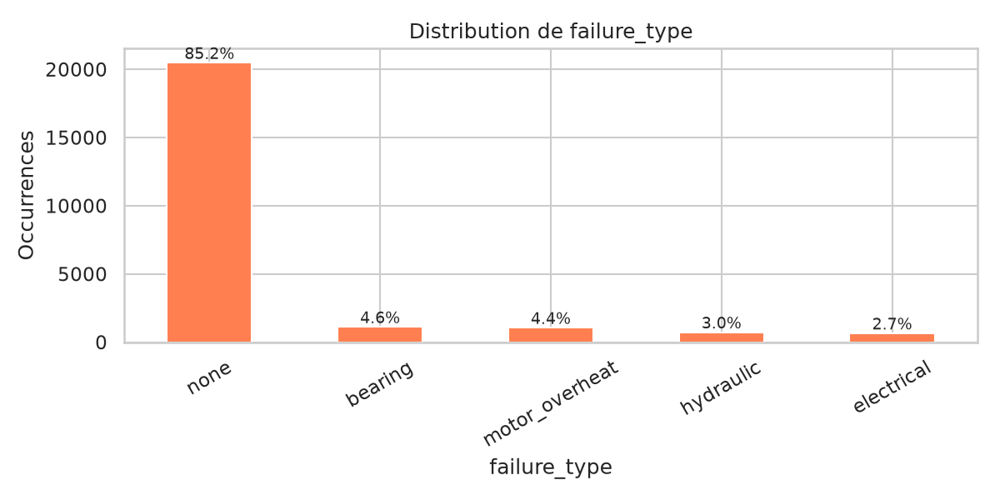

| Classe | Effectif | Proportion |
|---|---|---|
| `none` | 20 482 | 85,2 % |
| `bearing` | 1 117 | 4,6 % |
| `motor_overheat` | 1 060 | 4,4 % |
| `hydraulic` | 728 | 3,0 % |
| `electrical` | 655 | 2,7 % |

Le dataset est **fortement déséquilibré** : la classe `none` représente 85 % des observations, avec un ratio de 31:1 par rapport à la classe minoritaire (`electrical`). Le taux de défaillance global est de 14,8 %. Cette contrainte a guidé tous les choix de modélisation et de métrique.

### 2.3 Valeurs manquantes

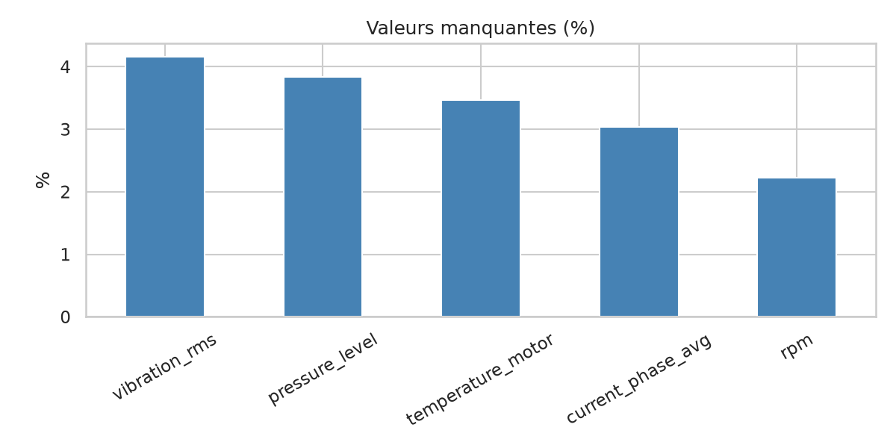

Cinq features numériques présentent des valeurs manquantes :

| Feature | Valeurs manquantes | % |
|---|---|---|
| `vibration_rms` | 1 000 | 4,2 % |
| `pressure_level` | 924 | 3,8 % |
| `temperature_motor` | 834 | 3,5 % |
| `current_phase_avg` | 731 | 3,0 % |
| `rpm` | 533 | 2,2 % |

Ces manques correspondent vraisemblablement à des capteurs défaillants ou non connectés selon le type de machine. La **médiane** a été retenue pour l'imputation (robuste aux valeurs extrêmes liées aux pannes).

### 2.4 Distributions des features numériques

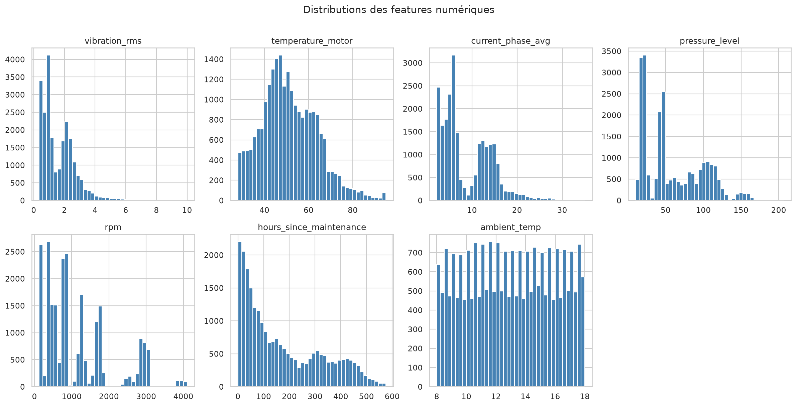

Les amplitudes sont hétérogènes (`rpm` ≈ 100–4000 vs `vibration_rms` ≈ 0,35–10), ce qui justifie un `StandardScaler` avant les modèles sensibles à l'échelle. Les distributions sont généralement unimodales avec des queues à droite sur `vibration_rms` et `hours_since_maintenance`.

### 2.5 Boxplots par type de défaillance

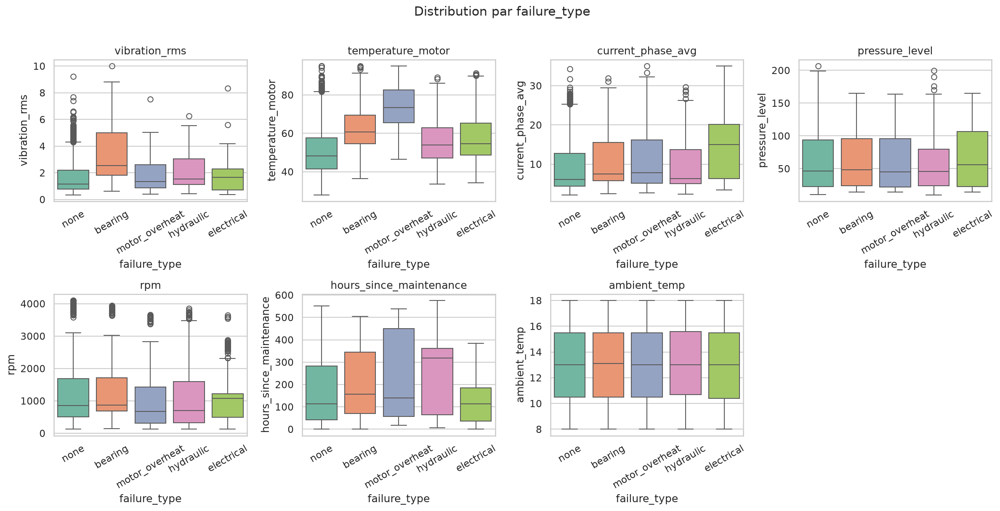

Les boxplots révèlent les features les plus discriminantes entre classes :
- `vibration_rms` : valeurs nettement plus élevées pour `bearing` et `motor_overheat`
- `temperature_motor` : pic sur `motor_overheat` (attendu physiquement)
- `current_phase_avg` : signal fort pour `electrical`
- `pressure_level` et `rpm` : discriminants pour `hydraulic`

Des valeurs extrêmes sont visibles sur plusieurs features, particulièrement sur `vibration_rms` (max 10,0 vs médiane 1,27). Ces outliers **n'ont pas été filtrés** : ils correspondent à des états réels de dégradation machine et constituent une information discriminante pour la classification. Les modèles à base d'arbres (Random Forest, XGBoost) sont naturellement robustes aux outliers — ils partitionnent l'espace par seuils et ne sont pas affectés par les valeurs extrêmes contrairement aux modèles linéaires.

### 2.6 Matrice de corrélation

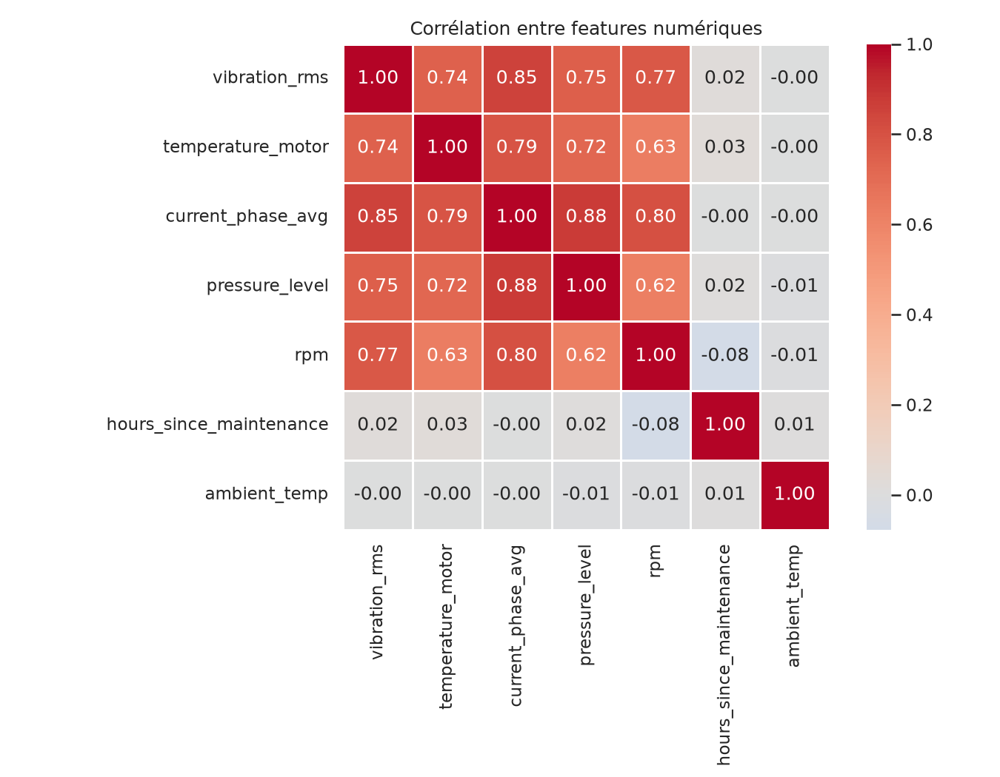

Les corrélations les plus notables sont : `pressure_level` / `current_phase_avg` (~0,88), `vibration_rms` / `current_phase_avg` (~0,85). **Aucune feature n'a été supprimée** pour multicolinéarité : le niveau de corrélation ne justifie pas de réduction, et les modèles ensemblistes (Random Forest, XGBoost) gèrent nativement la redondance partielle entre features.

### 2.7 Feature engineering

Aucun feature engineering supplémentaire n'a été réalisé. Les variables du dataset proviennent directement des capteurs industriels et possèdent déjà une forte signification métier. Les modèles basés sur les arbres, comme XGBoost et Random Forest, étant capables d'apprendre automatiquement des interactions complexes entre les variables, la création de nouvelles caractéristiques n'a pas apporté d'amélioration significative lors des premiers essais.

Les 9 features brutes (7 numériques + 2 catégorielles) ont été utilisées directement après preprocessing. Cette décision repose sur :
- Les features capteurs ont une sémantique physique directe et ne nécessitent pas de transformation métier
- XGBoost et Random Forest capturent les interactions non-linéaires et les combinaisons de features sans qu'il soit nécessaire de les créer explicitement
- L'analyse SHAP confirme que les features existantes sont suffisamment discriminantes (recall macro 0,954)

---

## 3. Pipeline de prétraitement

Le prétraitement est encapsulé dans un `ColumnTransformer` scikit-learn, lui-même intégré dans chaque pipeline modèle. Cette approche garantit qu'**aucune transformation n'est dupliquée côté API** (pas de *train/serve skew*).

```
Input (9 features brutes)
        │
        ├── Features numériques (7)
        │       ├── SimpleImputer(strategy="median")
        │       └── StandardScaler()
        │
        └── Features catégorielles (2)
                └── OneHotEncoder(handle_unknown="ignore")
                        → machine_type : 4 catégories → 4 colonnes
                        → operating_mode : 3 catégories → 3 colonnes
                        
Output : 7 + 4 + 3 = 14 features transformées
```

**Justification des choix :**

- **Imputation médiane** : robuste aux valeurs extrêmes (les mesures capteurs en phase de panne sont souvent aberrantes). La moyenne serait tirée vers le haut par ces outliers.
- **StandardScaler** : nécessaire pour la Régression Logistique (algorithme basé sur la distance). Sans scaling, les features à grande amplitude (`rpm` ≈ 2000) domineraient les features à faible amplitude (`vibration_rms` ≈ 1). Sans effet sur les modèles à base d'arbres (Random Forest, XGBoost), mais conservé pour homogénéité du pipeline.
- **OneHotEncoder** avec `handle_unknown="ignore"` : si une valeur catégorielle inconnue arrive en production (nouveau type de machine), le pipeline ne plante pas — il encode avec des zéros.
- **Pipeline intégré** : sérialiser le pipeline complet (preprocessing + classifieur) via joblib garantit que l'API reçoit les features brutes et délègue intégralement la transformation au modèle.

### Gestion du déséquilibre des classes

Le déséquilibre 31:1 a été traité différemment selon le modèle :

| Modèle | Stratégie |
|---|---|
| Logistic Regression | `class_weight="balanced"` |
| Random Forest | `class_weight="balanced"` |
| XGBoost | `sample_weight` calculé via `compute_class_weight` |
| TF MLP | `class_weight` dict passé à `.fit()` |

Le paramètre `balanced` pondère chaque classe inversement proportionnellement à sa fréquence, forçant le modèle à accorder autant d'importance aux classes rares qu'à `none`. SMOTE et under-sampling ont été implémentés mais non retenus pour l'entraînement final (les poids de classe ont donné de meilleurs résultats sur la validation croisée).

---

## 4. Modèles entraînés

### 4.1 Justification du choix des modèles

Quatre modèles ont été entraînés, couvrant un spectre allant du modèle linéaire au réseau de neurones :

**Régression Logistique (baseline)** : modèle de référence. Simple, interprétable, rapide. Permet d'établir un plancher de performance et de valider que le pipeline fonctionne correctement. Ses limites (hypothèse de linéarité) sont attendues sur ce type de données.

**Random Forest** : ensemble d'arbres de décision. Robuste aux outliers, gère naturellement les interactions entre features, peu sensible au scaling. Offre une importance des features native et des sorties SHAP pour l'interprétabilité.

**XGBoost** : gradient boosting, construit les arbres séquentiellement pour corriger les erreurs du modèle précédent. Généralement plus performant que Random Forest sur les données tabulaires structurées. Gestion du déséquilibre via `sample_weight`.

**TF MLP (Multi-Layer Perceptron)** : réseau de neurones dense (128 → Dropout(0.3) → 64 → Dropout(0.2) → softmax). Testé pour vérifier si la non-linéarité profonde apporte un gain sur ce problème tabulaire. Exporté en ONNX pour interopérabilité.

### 4.2 Hyperparamètres clés

| Modèle | Paramètres principaux |
|---|---|
| Logistic Regression | `solver=lbfgs`, `max_iter=1000`, `class_weight=balanced` |
| Random Forest | `n_estimators=200`, `class_weight=balanced`, `n_jobs=-1` |
| XGBoost | `objective=multi:softprob`, `eval_metric=mlogloss`, `sample_weight` |
| TF MLP | `epochs=50`, `batch_size=256`, `EarlyStopping(patience=5)` |

---

## 5. Évaluation et comparaison des modèles

### 5.1 Choix de la métrique principale

**La métrique principale est le Recall macro.** Dans un contexte de maintenance prédictive, une fausse alarme (prédire une panne qui n'existe pas) est beaucoup moins coûteuse qu'un faux négatif (manquer une panne réelle). Le recall macro traite chaque classe à égalité indépendamment de son effectif, ce qui est crucial avec un déséquilibre 31:1.

L'accuracy n'est pas pertinente ici : un modèle qui prédirait toujours `none` obtiendrait 85 % d'accuracy sans aucune valeur opérationnelle.

### 5.2 Courbes ROC

Les courbes ROC one-vs-rest illustrent la capacité de discrimination par classe pour chaque modèle.

| Logistic Regression | Random Forest |
|---|---|
| 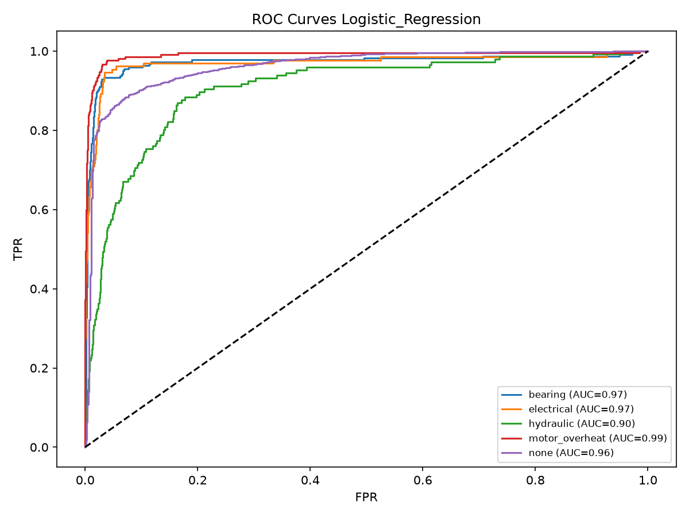 | 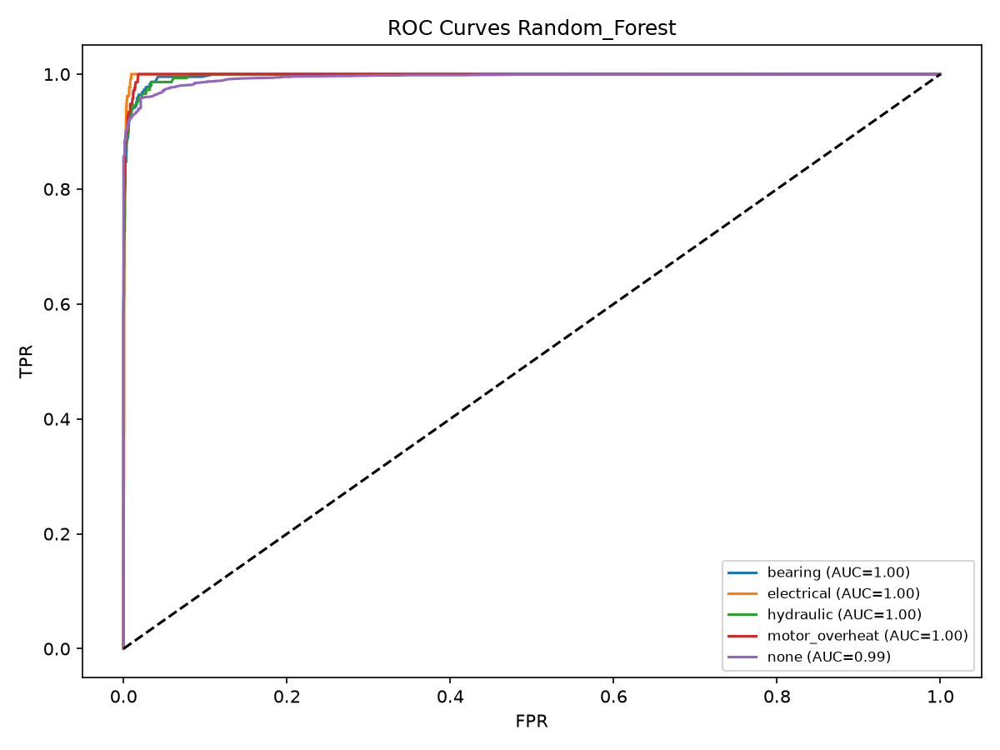 |

| XGBoost | TF MLP |
|---|---|
| 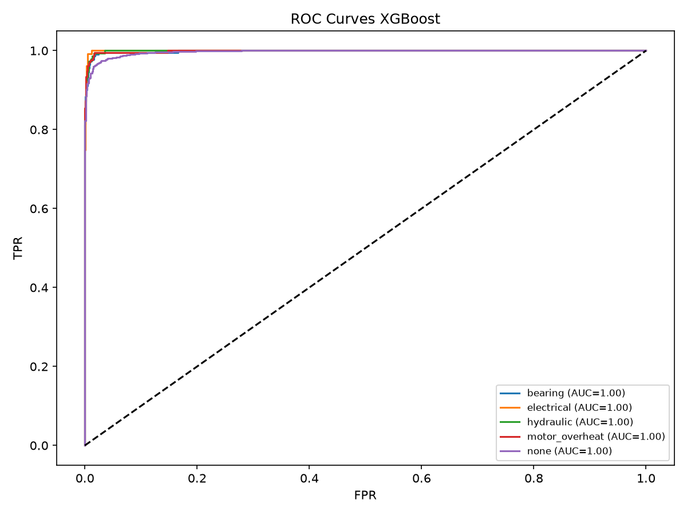 | 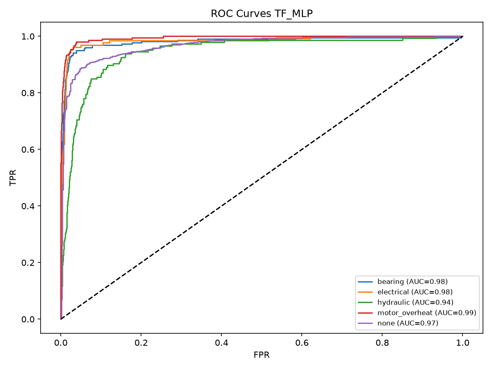 |

### 5.3 Matrices de confusion

| Logistic Regression | Random Forest |
|---|---|
| 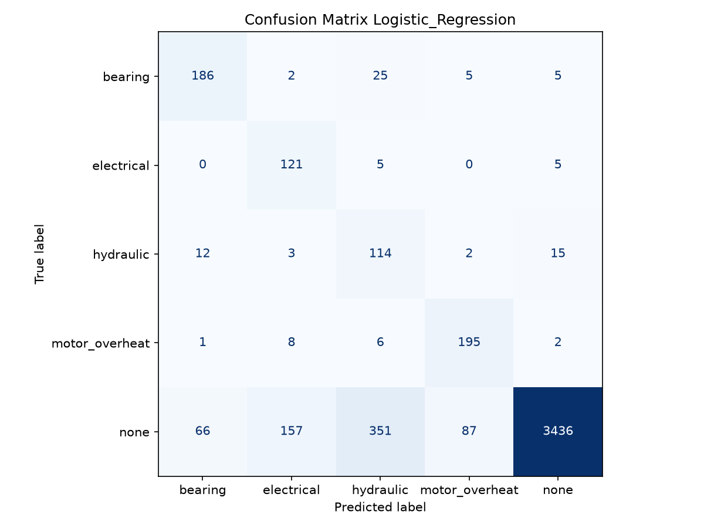 | 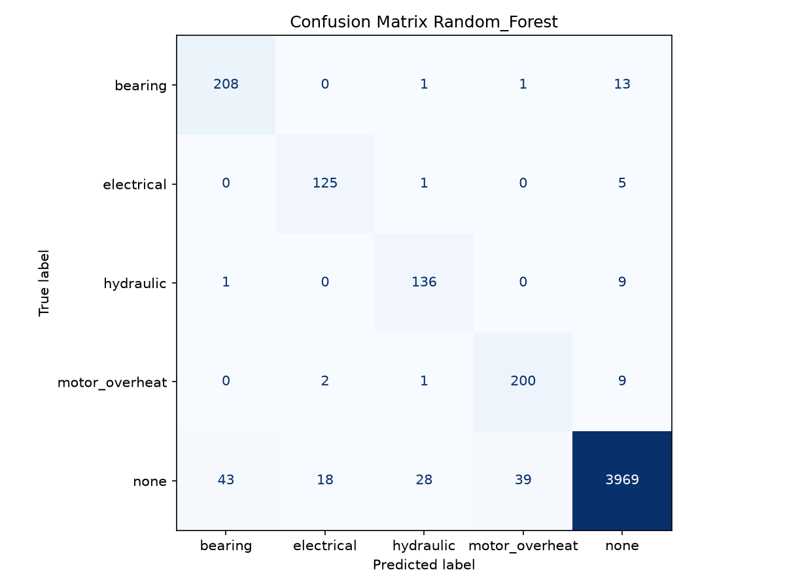 |

| XGBoost | TF MLP |
|---|---|
|  |  |

### 5.4 Résultats sur le jeu de test (80/20, stratifié)


| Modèle | Recall macro | F1 macro | ROC-AUC macro | PR-AUC macro |
|---|---|---|---|---|
| Logistic Regression | 0,8594 | 0,6751 | 0,9592 | 0,7461 |
| Random Forest | 0,9461 | 0,9031 | 0,9974 | 0,9664 |
| **XGBoost** | **0,9536** | **0,9261** | **0,9985** | **0,9842** |
| TF MLP | 0,8763 | 0,7333 | 0,9742 | 0,7828 |

### 5.5 Validation croisée (5 folds stratifiés)

| Modèle | Recall macro (CV) | F1 macro (CV) | ROC-AUC (CV) |
|---|---|---|---|
| Logistic Regression | 0,8487 ± 0,006 | 0,6803 ± 0,006 | 0,9638 ± 0,005 |
| Random Forest | 0,9349 ± 0,011 | 0,9014 ± 0,010 | 0,9953 ± 0,001 |

La faible variance de la validation croisée confirme que les modèles ne sur-apprennent pas et généralisent bien.

### 5.6 Importance des features et SHAP

L'importance des features (gain moyen sur les splits) et l'analyse SHAP (valeurs de Shapley, interprétation causale) ont été calculées sur Random Forest et XGBoost.

| Feature Importance — XGBoost | Feature Importance — Random Forest |
|---|---|
| 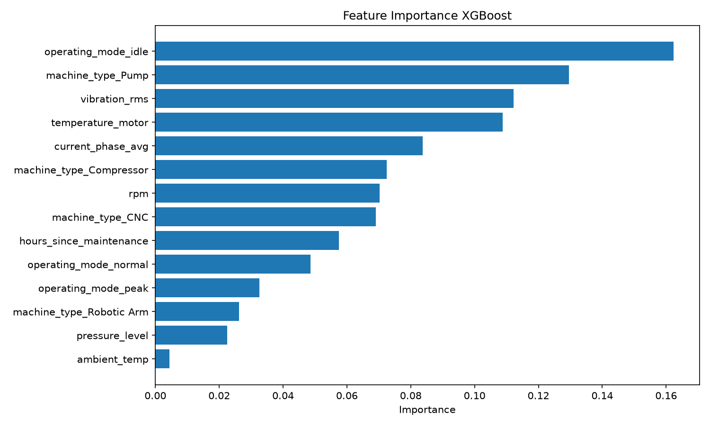 | 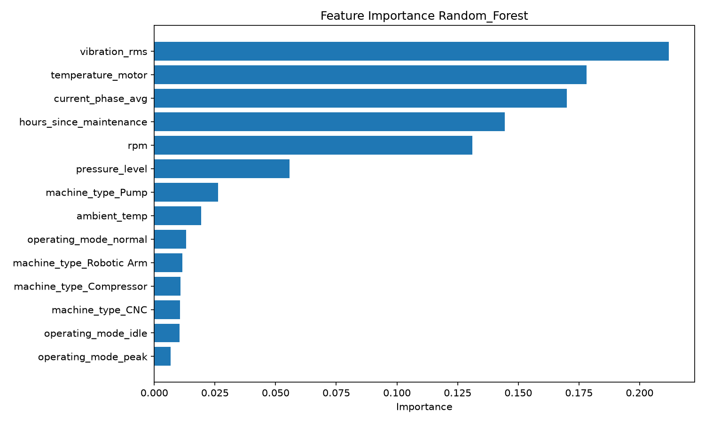 |

**SHAP — Random Forest** (mean |SHAP value| sur le jeu de test) :

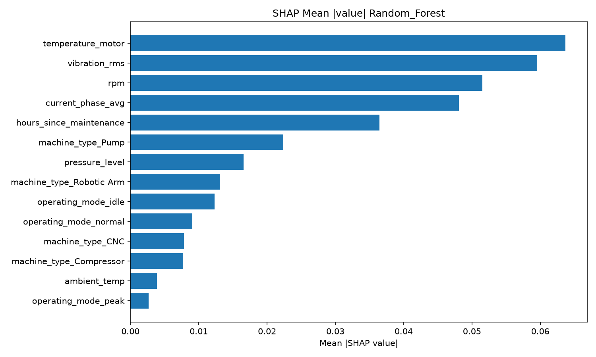

L'analyse SHAP confirme que `vibration_rms`, `temperature_motor` et `rpm` sont les features les plus déterminantes, ce qui est cohérent avec le domaine : vibration et température sont les indicateurs physiques les plus directs d'une défaillance mécanique.

### 5.7 Analyse des résultats

**XGBoost** est retenu comme modèle final avec un Recall macro de **0,9536** et un F1 macro de **0,9261**. Il surpasse Random Forest sur tous les critères, et dépasse largement la Régression Logistique et le TF MLP.

Le TF MLP, malgré sa complexité supérieure, n'apporte pas de gain par rapport aux modèles à base d'arbres. Ce résultat est cohérent avec la littérature : sur des données tabulaires structurées de taille modérée, le gradient boosting surpasse généralement les réseaux de neurones denses.

La ROC-AUC de 0,9985 pour XGBoost indique une excellente capacité de discrimination entre les 5 classes. La PR-AUC de 0,9842 (métrique robuste au déséquilibre) confirme ce résultat même sur les classes minoritaires.

---

## 6. Architecture de déploiement

### 6.1 Séparation entraînement / service

L'architecture respecte une séparation stricte entre la phase d'entraînement et la phase de service :

```
[training/]                          [API/]
  train.py                             FastAPI
  └── Pipeline sklearn                 └── model_service.py
       (prep + XGBClassifier)               └── joblib.load(XGBoost.pkl)
       └── joblib.dump()                         └── pipeline.predict_proba(df)
            └── XGBoost.pkl ──copy──> API/models/XGBoost.pkl
```

Le script `train.py` copie automatiquement le modèle dans `API/models/` à la fin de l'entraînement. L'API charge le pipeline complet (preprocessing inclus) via joblib et transmet les features brutes directement — sans reproduire aucune transformation.

### 6.2 API REST (FastAPI)

Trois endpoints :

| Endpoint | Description |
|---|---|
| `GET /health` | Statut du service et état de chargement du modèle |
| `POST /predict` | Prédiction du type de défaillance à partir des features brutes |
| `GET /model-info` | Métadonnées du pipeline chargé |

La validation des entrées (types, bornes, catégories autorisées) est assurée par les modèles Pydantic. En l'absence de modèle, l'API démarre en **mode dégradé** (`model_loaded: false`, `/predict` retourne 503) — utile pour valider l'infrastructure avant de déposer un modèle.

### 6.3 Containerisation et déploiement

L'ensemble de l'application est containerisé via Docker Compose. Deux services sont définis à la racine du projet :

- **`prediction-defaillance-api`** — service FastAPI, charge le modèle via bind mount (`./API/models:/app/models`). Le bind mount découple le cycle de vie du modèle du container : mettre à jour le modèle ne nécessite pas de reconstruire l'image. L'API n'est **pas exposée publiquement** : elle est uniquement accessible sur le réseau Docker interne `maintenance-network`.
- **`prediction-defaillance-front`** — service Streamlit, construit depuis `front/Dockerfile`. Connecté au réseau `maintenance-network` pour joindre l'API via son nom de service (`http://prediction-defaillance-api:8000`), et au réseau externe du reverse proxy pour être exposé publiquement.

Le frontend est accessible publiquement à l'adresse :

| Ressource | URL |
|---|---|
| Application Streamlit | `https://prediction.spokayhub.top` |
| Code source (GitHub) | `https://github.com/Spokay/efrei-data-science-machine-maintenance-prediction` |

Le routage HTTPS est assuré par un reverse proxy (Nginx Proxy Manager). Seul le container frontend est connecté au réseau du proxy — l'API reste isolée sur le réseau interne et n'est joignable que depuis le frontend.

### 6.4 Reproductibilité

- `random_state=42` fixé sur tous les modèles et le split train/test
- `xgboost==2.1.4` épinglé dans les deux environnements (training et API) pour garantir la compatibilité de sérialisation
- Split stratifié (80/20) pour conserver la distribution des classes dans chaque partition

---

## Conclusion

XGBoost avec pondération des classes par `sample_weight` est le modèle retenu. Il atteint un **Recall macro de 0,954** et un **F1 macro de 0,926**, surpassant tous les autres modèles testés. Le pipeline sklearn intégré garantit l'absence de divergence entre entraînement et service. L'architecture API/modèle sépare clairement les responsabilités et permet des mises à jour du modèle sans interruption de service.

Ce projet a permis de mettre en œuvre l'ensemble des étapes d'un pipeline de Data Science appliqué à la maintenance prédictive. À partir de données issues de capteurs industriels, une analyse exploratoire a permis de comprendre la structure du jeu de données et d'orienter les choix de prétraitement. Les transformations réalisées ont permis de construire un dataset propre et adapté à l'entraînement des modèles.

Plusieurs approches de Machine Learning ont ensuite été comparées à l'aide de métriques adaptées au déséquilibre des classes. Le modèle XGBoost a obtenu les meilleures performances tout en restant interprétable grâce à l'analyse de l'importance des variables et aux explications SHAP.

Le modèle retenu a ensuite été intégré dans une architecture complète reposant sur FastAPI, Docker et Nginx afin de proposer un service de prédiction exploitable. Cette approche illustre la transition entre un prototype de Data Science et une solution pouvant être intégrée dans un environnement professionnel.

Au-delà des performances obtenues, ce projet montre qu'une démarche méthodique de préparation des données, de comparaison des modèles et d'interprétation des résultats constitue un élément essentiel pour développer une solution fiable d'aide à la décision. Dans un contexte industriel, une telle approche peut contribuer à anticiper les défaillances des équipements, réduire les coûts de maintenance et limiter les interruptions de production.

